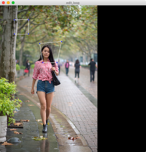
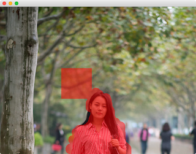
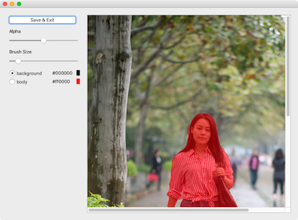

# dnnutil

Toolkit for Deep Convolutional Neural Network.  


## Dependency

```bash
pip3 install opencv-python
pip3 install PyOpenGL
pip3 install glfw
pip3 install PyQt5
pip3 install Pillow
```


## Codes

### [edit_loops.py](edit_loops.py)

a function to let user segment an image with loop  




## [qwidgetpainter.py](qwidgetpainter.py)

A class derived from QWidget for painting segmentation color directory on the top of an image using brush.




## [qwidgetpaintergui.py](qwidgetpaintergui.py)

A class derived from QWidget equipped with GUI components (e.g., buttons and sliders) for painting segmentation color directory on the top of an image using brush.  




