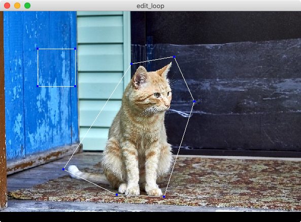
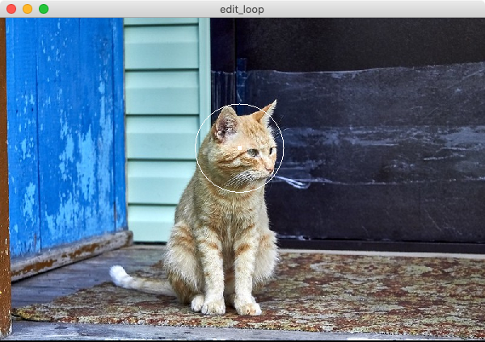
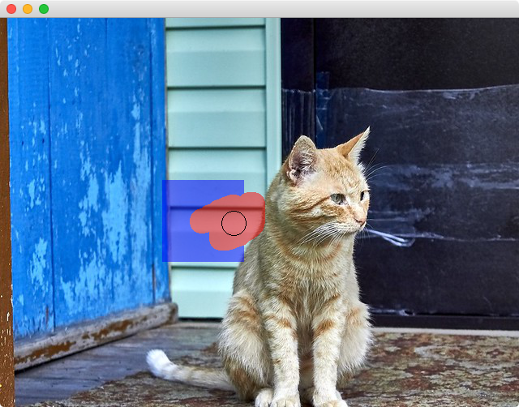
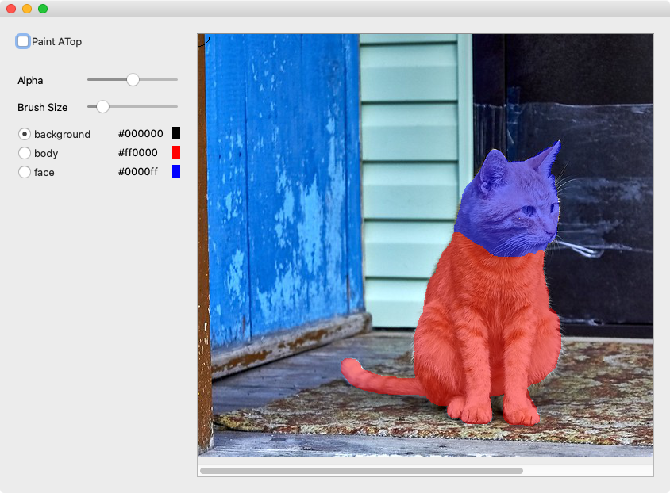

# dnnutil

Toolkit for Deep Convolutional Neural Network.  


## Dependency

```bash
pip3 install Pillow
```

- python file with `cv_` prefix

```bash
pip3 install opencv-python
```

- python file with `gl_` prefix

```bash
pip3 install PyOpenGL
pip3 install glfw
```

- python file with `qt_` prefix

```bash
pip3 install PyQt5
```

- python file with `torch_` prefix

```bash
pip3 install torch
```


## Codes

### [gl_editloops.py](gl_editloops.py)

a function to let user segment an image with loop  




### [gl_editkprad.py](gl_editkprad.py)

a function to let the user edit the position and radius of a keypoint. 




## [qt_painter.py](qt_painter.py)

A class derived from QWidget for painting segmentation color directory on the top of an image using brush.




## [qt_paintergui.py](qt_paintergui.py)

A class derived from QWidget equipped with GUI components (e.g., buttons and sliders) for painting segmentation color directory on the top of an image using brush.  




